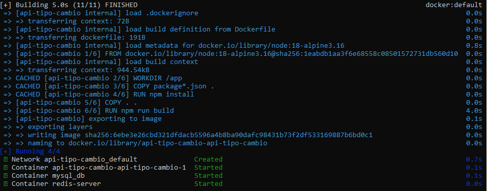
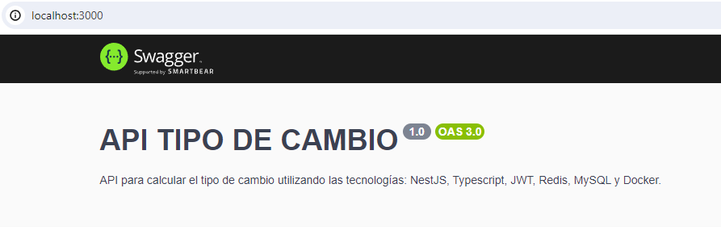
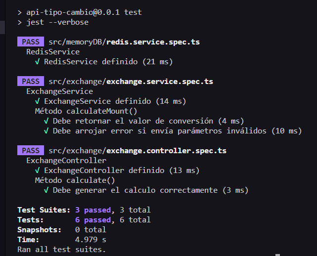
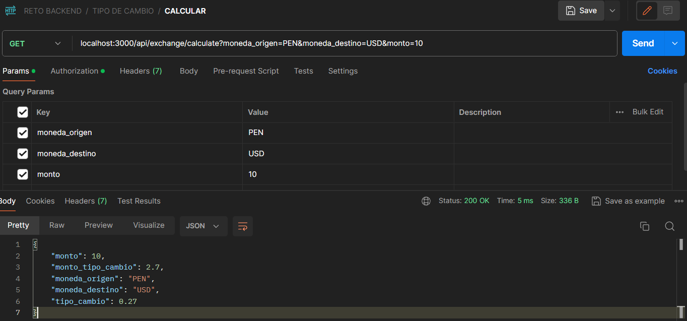
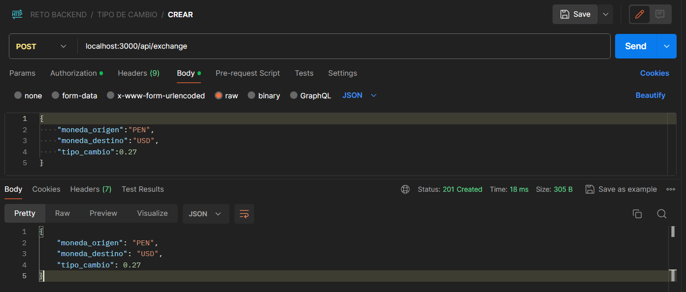
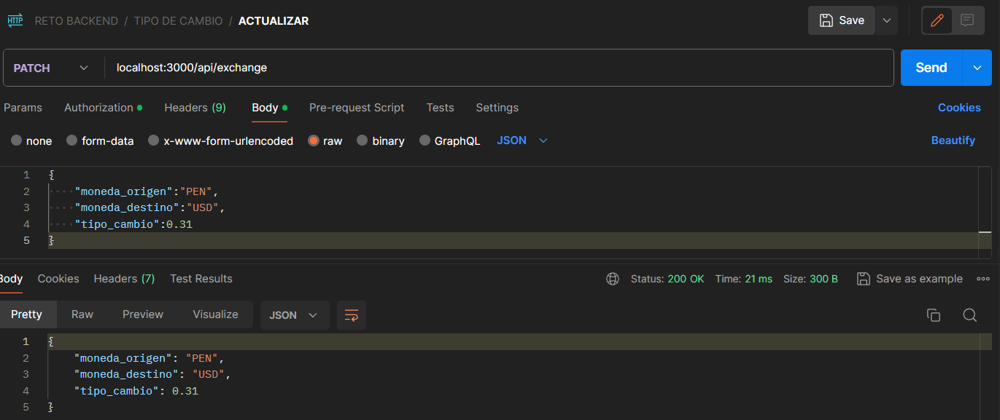

## Descripción

API para calcular el tipo de cambio utilizando las tecnologías: NestJS, Typescript, JWT, Redis, MySQL y Docker.

## Ejecutar aplicación en local

```bash
$ docker-compose up -d
```

<br/>

## Acceder a la documentación en local

```bash
# Escuchar en http://localhost:3000
```

<br/>

## Testing de pruebas unitarias

```bash
# unit tests
$ npm run test
```


<br/>

## Endpoints

### Cambio de moneda

```bash
GET
localhost:3000/api/exchange/calculate?moneda_origen=PEN&moneda_destino=USD&monto=10
```



### Crear tipo de cambio

```bash
POST
localhost:3000/api/exchange
Valores en el cuerpo de la solicitud:
{
	"moneda_origen":"PEN",
	"moneda_destino":"USD",
	"tipo_cambio":0.27
}
```



### Actualizar tipo de cambio

```bash
PATCH
localhost:3000/api/exchange
Valores en el cuerpo de la solicitud:
{
    "moneda_origen":"PEN",
    "moneda_destino":"USD",
    "tipo_cambio":0.31
}
```




<br/>

## Autor
Andrés Quispe.